* Table of Contents
  {:toc}

---

## **Introduction**
Momentum is a desktop app that helps freelancers track time spent on different projects and gain insights on how their time is spent.

It is designed for people that prefer typing, so that frequent tasks can be done faster by typing in commands.

This developer guide provides information about the architecture and implementation of Momentum. It gives developers interested in developing Momentum a good start in knowing how the application works, without going too much into the lower level details. It also provides information for testers on how to test the product.

**:information_source: Some things to take note of in this guide:** 
* When a notation like `Foo#bar` is used (e.g. "The method `Foo#bar` is called...") it refers too the `bar` method from the `Foo` class.
* Method references made in this document will only include arguments if relevant to what is being explained.

## **Setting up, getting started**

Refer to the guide [_Setting up and getting started_](SettingUp.md).

---

## **Design**

### Architecture

**`Main`** has two classes called [`Main`](https://github.com/AY2021S1-CS2103T-T10-1/tp/blob/master/src/main/java/seedu/momentum/Main.java) and [`MainApp`](https://github.com/AY2021S1-CS2103T-T10-1/tp/blob/master/src/main/java/seedu/momentum/MainApp.java). It is responsible for,

* At app launch: Initializes the components in the correct sequence, and connects them up with each other.
* At shut down: Shuts down the components and invokes cleanup methods where necessary.

[**`Commons`**](#common-classes) represents a collection of classes used by multiple other components.

The rest of the App consists of four components.

* [**`UI`**](#ui-component): The UI of the App.
* [**`Logic`**](#logic-component): The command executor.
* [**`Model`**](#model-component): Holds the data of the App in memory.
* [**`Storage`**](#storage-component): Reads data from, and writes data to, the hard disk.

Each of the four components,

* defines its _API_ in an `interface` with the same name as the Component.
* exposes its functionality using a concrete `{Component Name}Manager` class (which implements the corresponding API `interface` mentioned in the previous point.

For example, the `Logic` component (see the class diagram given below) defines its API in the `Logic.java` interface and exposes its functionality using the `LogicManager.java` class which implements the `Logic` interface.

**How the architecture components interact with each other**

The _Sequence Diagram_ below shows how the components interact with each other for the scenario where the user issues the command `delete 1` when in project view.

The sections below give more details of each component.

### UI component

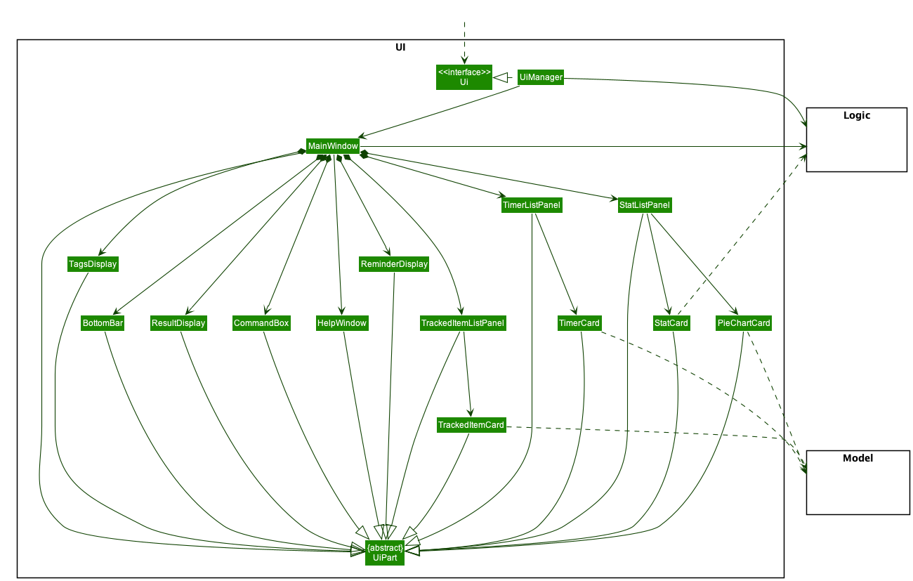

**API** :
[`Ui.java`](https://github.com/se-edu/addressbook-level3/tree/master/src/main/java/seedu/address/ui/Ui.java)

The UI consists of a `MainWindow` that is made up of parts e.g.`CommandBox`, `ResultDisplay`, `TrackedItemListPanel`, `BottomBar` etc. All these, including the `MainWindow`, inherit from the abstract `UiPart` class.

The `UI` component uses JavaFx UI framework. The layout of these UI parts are defined in matching `.fxml` files that are in the `src/main/resources/view` folder. For example, the layout of the [`MainWindow`](https://github.com/se-edu/addressbook-level3/tree/master/src/main/java/seedu/address/ui/MainWindow.java) is specified in [`MainWindow.fxml`](https://github.com/se-edu/addressbook-level3/tree/master/src/main/resources/view/MainWindow.fxml)

The `UI` component,

* Executes user commands using the `Logic` component.
* Various UI parts such as `TrackedItemCard`, `TimerCard`, `PieChartCard` listen for changes to `Model` data so that they can be updated with the modified data.
* `MainWindow` has an association to `Logic` as it will call on `Logic` to fetch certain data for the some of the UI parts such as `StatCard`.

### Logic component

**API** :
[`Logic.java`](https://github.com/AY2021S1-CS2103T-T10-1/tp/blob/master/src/main/java/seedu/momentum/logic/Logic.java)

1. `Logic` uses the `ProjectBookParser` class to parse the user command.
1. This results in a `Command` object which is executed by the `LogicManager`.
1. The command execution can affect the `Model` (e.g. adding a project).
1. The result of the command execution is encapsulated as a `CommandResult` object which is passed back to the `Ui`.
1. In addition, the `CommandResult` object can also instruct the `Ui` to perform certain actions, such as displaying help to the user.

Given below is the Sequence Diagram for interactions within the `Logic` component for the `execute("delete 1")` API call when in project view.

:information_source: <strong>Note:</strong> The lifeline for `DeleteCommandParser` should end at the destroy marker (X) but due to a limitation of PlantUML, the lifeline reaches the end of diagram.

### Model component

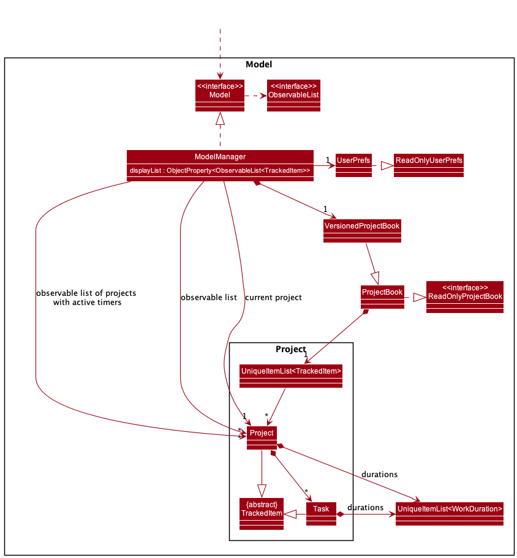

**API** : [`Model.java`](https://github.com/se-edu/addressbook-level3/tree/master/src/main/java/seedu/address/model/Model.java)

//TODO: remove the stores part for private fields, remove task package, show trackeditem abstract class, task in project package

The `Model`:

* Stores a `UserPref` object that represents the user’s preferences.
* Stores a `VersionedProjectBook` object that contains Momentum's data.
* Stores a `ReminderManager` object that schedules and removes reminders.
* Stores the following attributes for sorting of `ObservableList<TrackedItems>`:

    * `SortType` object that defines the sort type imposed on the `ObservableList<TrackedItems>`.
    * `boolean` object that defines whether the `ObservableList<TrackedItems>` of total projects and tasks is sorted by ascending order.
    * `boolan` object that defines whether the `ObservableList<TrackedItems>` of total projects and tasks is sorted by completion status.

* Stores a `ViewMode` object that represents the current view mode of Momentum (Task view or Project view).
* Stores a `Project` object that represents the current project Momentum is viewing if user is in Task view within a project.
* Stores a `boolean` object that defines whether the tags display is visible to the users.
* Exposes an unmodifiable `ObjectProperty<ObservableList<TrackedItem>>` that stores the projects or tasks that are currently displayed to the user.
* Exposes an unmodifiable `ObservableList<TrackedItems>` that stores projects or tasks that can be 'observed' e.g. the UI can be bound to this list so that the UI automatically updates when the data in the list change.
* Exposes an unmodifiable `ObservableList<TrackedItems>` that stores the total projects or tasks with running timers that can be 'observed' e.g. the UI can be bound to this list so that the UI automatically updates when the data in the list change.

Packages in the `Model`: //TODO: add all other packages and rewrite the project and task section.

* The `project` package contains classes representing a `Project` and a `Task`. All relevant clas

* The `project` package contains classes representing a `Project` and `Task` that can be added by a user under a project, such that a project can have a list of tasks.
Both `Project` and `Task` extend `TrackedItem` and implement `UniqueItem` interface.

### Storage component

**API** : [`Storage.java`](https://github.com/AY2021S1-CS2103T-T10-1/tp/blob/master/src/main/java/seedu/momentum/storage/Storage.java)

The `Storage` component,

* can save `UserPref` objects in json format and read it back.
* can save `JsonAdaptedProject` objects in `JsonSerializableProjectBook` in json format and read it back.

The `JsonAdaptedTask` component contains fields of a `Task` in json format:

* `name` in `String` format
* `description` in `String` format
* `completionStatus` in `boolean` format
* `createdDate` in `String` format
* `deadline` in `String` format
* `reminder` in `String` format
* `tagged` in `List<JsonAdaptedTag>` format
* `durations` in `List<JsonAdaptedWorkDuration>` format
* `timer` in `JsonAdaptedTimer` format

In addition to the fields in `JsonAdaptedTask` component, `JsonAdaptedProject` contains a taskList in `List<JsonAdaptedTask>` format.

### Common classes

//TODO: change GUI window settings description

Classes used by multiple components are in the `seedu.momentum.commons` package. These classes contain methods or data used by various components and serve as a single source of such methods and data.

Notable classes in this package include:

* `Clock`: Acts as a consistent, single source of the 'current time' within the application
* `DateWrapper`, `TimeWrapper`, `DateTimeWrapper`: Represents dates and times within Momentum, with utility methods to calculate the dates and times required by various parts of the application.
* `UniqueItem`, `UniqueItemList`: Represents a list of unique items that are compared using a specially defined identity instead of the standard `equals()` method.
* `GuiThemeSettings`, `GuiWindowSettings`: Manages the GUI settings that can be changed by the user.
* `StatisticTimeFrame`, `StatisticTimeFrameSettings`: Manages the statistics settings that can be changed by the user.

There are also classes with useful utility methods used to handle different types of data, such as dates, times, strings, json and files.

---

## **Implementation**

This section describes some noteworthy details on how certain features are implemented.

### Adding Tasks to Projects

In Momentum, each project can contain a list of tasks. These can use used to represent various sub-tasks that the user needs to do as part of the project. This section will explain how this is implemented, and some alternative implementations that we have considered.

#### Chosen Implementation: Separate Task and Project

Both projects and tasks have many similarities. They share the following fields:

* Name
* Description
* Completion Status
* Reminder
* Deadline
* Created Date
* Tags

Additionally, both need to work with Momentum's time tracking and statistics features.
Therefore, it is reasonable to have an abstract `TrackedItem` class that contains the fields and methods shared by both projects and tasks, and have `Project` and `Task` extend from it.

Projects and tasks will then have fields and methods for the behaviours unique to each item. Specifically, a project will contain a list of tasks, and have methods that allow it to modify its own list of tasks. This results in the  structure illustrated by the class diagram below:

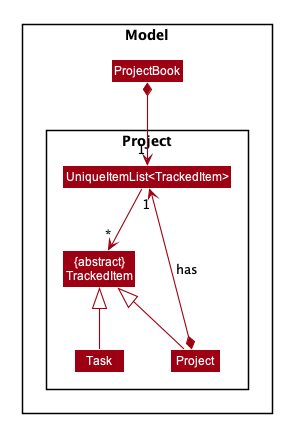

This allows us to take advantage of polymorphism to ensure that every command will work with both projects and tasks, without having to provide separate implementations for each.

Below is an object diagram to illustrate an example of the structure of some projects and tasks being tracked by Momentum:

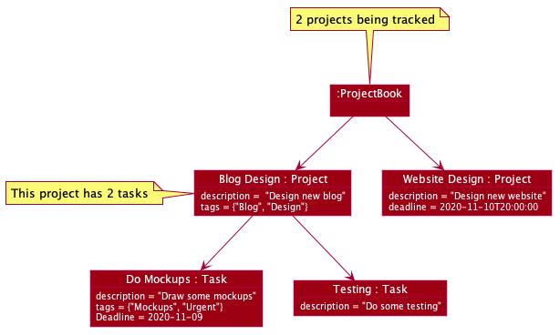

The `view` and `home` commands allow users to navigate between viewing a single project's tasks, and a view of all projects (with their tasks not visible).

This is implemented by having a list of tracked items to be shown to the user, `itemList`. This list is changed to be the project's task list when a `view` command is executed, and changed to the overall project list when a `home` command is executed. The list can then be further sorted using the [sort command](#sort-command) or filtered using the [find command](#find-command), to form a separate list, `displayList`, that is provided to the UI components to be   displayed to the user.

Most of the commands in Momentum thus become context sensitive, behaving differently depending on whether the project list is being viewed, or a task list if being viewed. For example, the `add` command would add a project if the user  is viewing the project list, but if the user is viewing a specific project's task list, it will add a task to that project instead.

We have identified the following benefits and drawbacks of this implementation.

Benefits:

* Having a `TrackedItem` parent class gives us the opportunity to easily extend Momentum to track other things beyond projects and tasks, while also making it easier to integrate new items with existing commands.
* Having a clear difference between `Project` and `Task` classes allows us to further differentiate projects and tasks in the future. Additional task or project specific features can be easily added without affecting the other.

Drawbacks:

* Some type casting is required for certain operations on projects and tasks, especially for testing purposes. While this is not neccessarily a bad thing, it may make the code less readable and harder to follow.

#### Alternative 1: Using Predicates

Another implementation we considered was to add all `Project` and `Task` objects to the same `UniqueItemsList`. 

This implementation shares some similarities with our chosen implementation. Both `Project` and `Task` will extend an abstract `TrackedItem` class.

However, it differs in the way the `displayList` is updated.

A rough summary of the proposed implementation is as follows:

* There will be two predicates. The first predicate will be used to check whether an object is a project or a task. The second predicate will be the normal predicate used to filter the list in the find command.
* Changes in view will modify the first predicate.
* Using the find command will modify the second predicate.
* The predicate used to determine the entries shown in the `displayList` is the logical AND of the first and second predicates.

We have identified the following benefits and drawbacks of this implementation.

Benefits:

* This implementation is much simpler than having to maintain a separate list of `Task` objects for each project. It is likely that existing commands would not have to be changed as much.

Drawbacks:

* A bi-directional association between projects and tasks will be needed. This is unnecessary as a project is composed of multiple tasks. Tasks do not need to know which project they are a part of.
* It might be harder and more time-consuming to write rigorous tests for this implementation.

#### Alternative 2: Projects can contain Projects

Since projects and tasks are so similar, it may make more sense to treat them as the same object in the first place. Therefore, it is possible to model a project's sub-tasks as projects themselves. This results in a structure where each project can contain a list of other projects, as illustrated below:

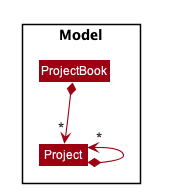

We have identified the following benefits and drawbacks of this implementation.

Benefits:

* This implementation is much simpler than having to maintain separate `Project` and `Task` classes. It is likely that existing commands would not have to be changed as much.
* Projects can contain not just sub-projects, but sub-sub-projects, sub-sub-sub-projects, etc, allowing for deeper nesting of projects. This may be useful for users to manage more complex project structures.

Drawbacks:

* We will be unable to differentiate between a project and sub-project, since they are both modeled as the same class. This means that project or sub-project specific features cannot be easily implemented without affecting the other.
* Allowing for deeper nesting of projects may make the application more confusing to use without significant UI changes.

### Immutability
`Projects`, `Tasks`, `Timers`, and `WorkDurations` are immutable. This means that anytime a project's details are changed, a new object is created with the new details, and the model is updated with the new object.

Notable examples include:
* Starting/Stopping a Timer: A new object is created with the updated timer state and durations,
* Editing a Project: A new object is created with the new project's details, with the same timer and durations recorded.

Below is an example of what happens when a project's timer is stopped:

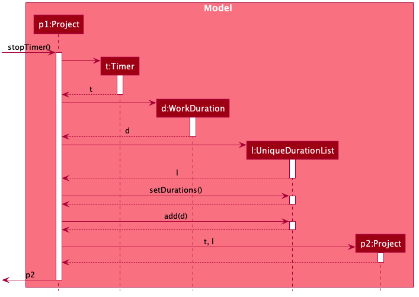

In this case, since the project's timer is being changed, new `TimerWrapper`, `WorkDuration`, `UniqueDurationList` objects are created, which are then used to create a new `Project`, which is subsequently used to replace the old `Project` in the model.

We chose to implement projects this way as immutability makes these classes more easily testable, and also to support [undo and redo commands](#undoredo-feature).

### Timers and Durations

Momentum allows users to track the time that they spend on each project and task. Time tracking is done by starting and stopping a timer using the `start` and `stop` commands. The period of time that the user spends is then stored as a `WorkDuration` object.

The below diagram illustrates the structure of the classes used for timetracking, and how they are used to calculate [statistics](#statistics).

 

Each project/task has a `TimerWrapper` that represents a timer that can track the time spent on that project. The timer can be started and stopped by the user using the `start`/`stop` commands.

The timer does not run actively (counting each second/millisecond), instead it records the time when it was started, and the time when it was stopped.  This implementation was chosen because it allows Momentum's timers to continue running even when the application is
closed, by saving the timer's start/stop times together with project/task data.

We chose to give each project and task its own timer as that allows Momentum to support running multiple timers concurrently, one for each project/task, for users that want to multi-task.

A `WorkDuration` represents a period of time that the user spent working on a project. Each `Project` contains a list of `WorkDuration` that represents each time the each the user starts and stops the timer for the project.

We chose to do this implementation to allow for flexibility in calculating statistics.

### Deadlines

#### Implementation of Deadline class

The deadline of a project and tasks is implemented using `DateWrapper` and `TimeWrapper`. The `dateWrapper` and `timeWrapper` is stored as `Optional<DateWrapper>` and `Optional<TimeWrapper>` in the `Deadline` class.

Since both date and time is optional in the class, a deadline is empty when both `dateWrapper` and `timeWrapper` is empty. An empty deadline can be created easily without `TrackedItem` needing to know whether it has a deadline. This design was chosen due to the ease of implementation. Another reason is because no dummy data will be required.

#### Alternative Implementation: Store Date and Time using `DateTimeWrapper`

An alternative design is to store date and time in a `DateTimeWrapper` with dummy date and time if the date or time is not present as `LocalDateTime` requires both date and time. However, extra checks will have to be done to differentiate between dummy and actual data.

#### Parsing a Deadline

The date and time of a deadline of a project or task is parsed separately using different prefixes. This design is chosen as date and time is stored separately and the format of date and time can be more flexible.

#### Alternative Implementation: Parsing Date and Time Together

An alternative design is to parse both date and time together. This is harder to implement as date and time is stored separately in deadline. This design would also restrict the format of the date and time.

#### Constraints of a Deadline

The deadline has to be on or after the created date. This is checked when the `Deadline` is instantiated. This constraint has been added so that more meaningful statistics can be generated.

For `EditCommand`, a descriptor of type `editTrackedItemDescriptor` containing edited fields is created directly from parsing the user input in `EditCommandParser`, hence the created date is unknown. A dummy date using `LocalDate.EPOCH` is passed into the constructor of `Deadline` in `EditCommandParser` to allow creation of the deadline. The check that deadline has to be on or after the created date is done in the `getUpdatedDeadline` method of `EditCommand` class after the created date of the project to be edited is known.

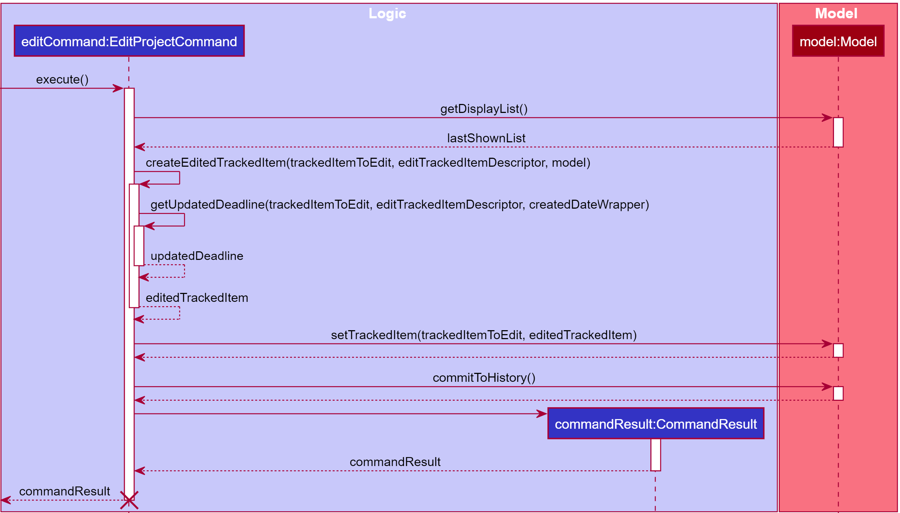

### Reminders

Users can add reminders to be notified on particular projects or tasks at the date and time specified.

Reminders are stored in a project or task. The runs and shows the name of the project or task in the reminder panel of the sidebar at the date and time while the application is opened. Reminders are removed after a reminder is runned at the specified date and time.

If application is not open at the date and time of the reminder or if there are multiple reminders scheduled at the same date and time, the reminder will be marked as missed. The `updateExpiredReminders` method in `ProjectBook` helps to update the missed reminders before rescheduling all the reminders.

#### Organisation of Reminder Related Classes

The reminder is stored as a `Reminder` class in a project or task. The date and time of a reminder is stored in `Reminder`.

`ReminderManager` schedules the reminder using the `schedule` method of the `Timer` class and runs the reminder using the `run` method of the `ThreadWrapper` class.

The diagram below shows the structure of the classes related to the `reminder` package.

//TODO: explain diagrams, try to make model not italicised

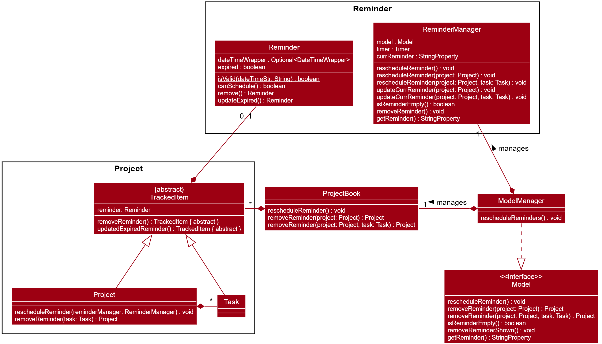

More details on the implementation of `ReminderManager` is given in the [Scheduling of Reminders](#scheduling-of-reminders) section.

#### Alternative Implementation: Manage Reminders using `Reminder` Class

An alternative would be to schedule and run the reminder in `Reminder` class directly. This design was not chosen as that `Reminder` would have to contain references to both `Model` and `ProjectBook`, which is undesired as the projects and tasks in the `ProjectBook` will have to be modified.

#### Rescheduling Reminders

Whenever a project or task is added, edited or removed, the reminders needs to be adjusted accordingly. The chosen implementation is to reschedule all the reminders. This is done through `Model#rescheduleReminders` which is further explained in the [Scheduling of Reminders](#scheduling-of-reminders) section.

#### Alternative Implementation: Reschedule Reminders of Projects or Tasks Changed

An alternative would be to only reschedule projects or tasks that are affected by the change. This design was not chosen as it is more complicated and would increase the coupling between `ReminderManager` and other related classes.

#### Scheduling of Reminders

`ReminderManager` contains a reference to a `Model` so that the projects and tasks can be iterated through callback methods and the reminders of the projects can be modified.

To schedule reminders, several callback functions are used to iterate through the project book in the model. The entry point is in `ModelManager` where `rescheduleReminders` can be called.
This method calls `ReminderManager#rescheduleReminder` so that the `timer` in `ReminderManager` can be resetted before the reminders are actually scheduled.

After resetting the `timer`, reminders are rescheduled by calling
`Model#rescheduleReminder`, which iterates through the project book through `ProjectBook#rescheduleReminder` and modifies the reminders. In this method, the expiration of the reminders will be updated through `ProjectBook#updateExpiredReminders`before the reminder of each project and task is rescheduled as shown in the diagram below.

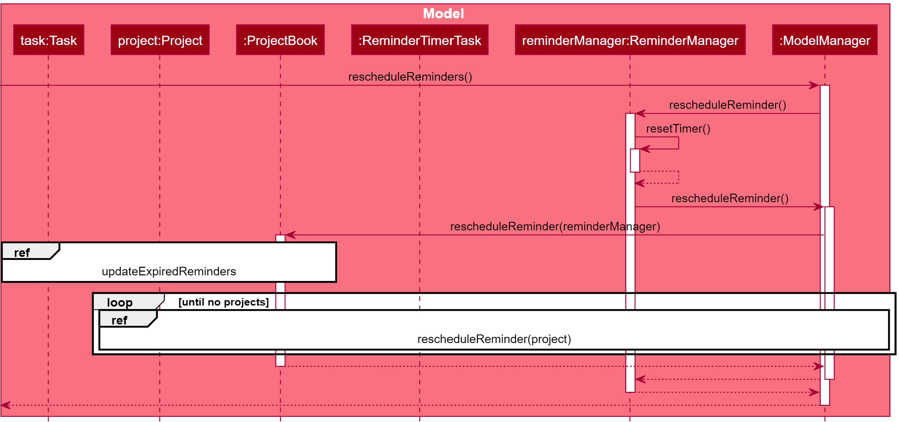

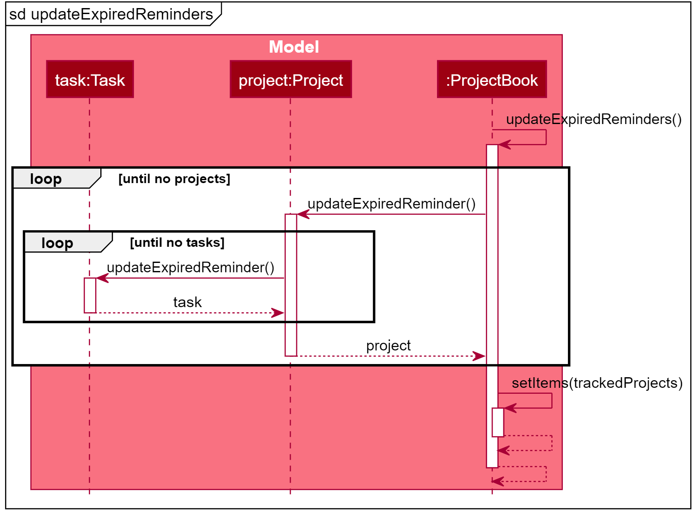

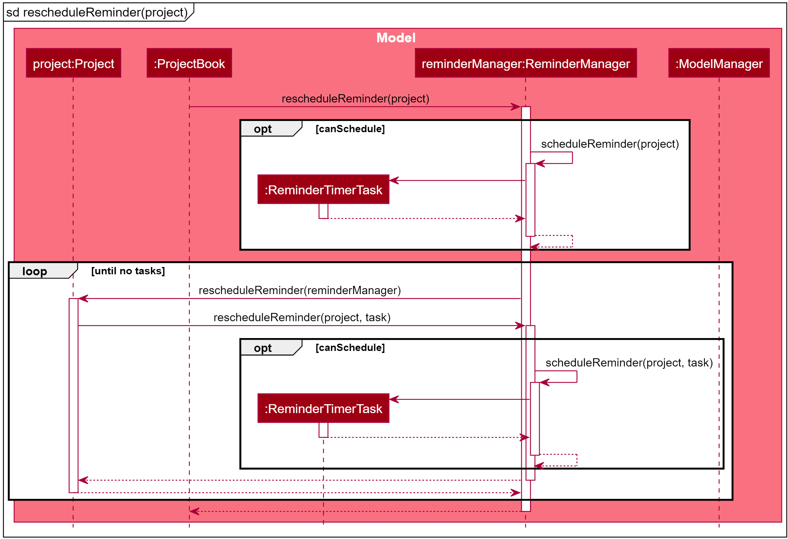

`ReminderManager` has an inner class `ReminderTimerTask` which implements `TimerTask` that is used to schedule a reminder with `Timer`. This design was chosen as `ReminderTimerTask` references non-static methods of `ReminderMananger` as well as `Model`, which is also referenced in `ReminderManager`. More details on how the reminders are runned using `ReminderTimerTask` is given in the [Running Reminders](#running-reminders) section

#### Alternative Implementation: Implement `ReminderTimerTask` as a Separate Class

An alternative implementation is to implement `ReminderTimerTask` as a separate class. With this implementation, `ReminderTimerTask` will have to contain extra references such as `ReminderManager` and `Model`.

#### Running Reminders

At the date and time scheduled, the reminder will be run.

In the process of running the reminders, the UI will show the reminder and it will be removed.

//TODO: put task, project and projectbook to the right of modelmanager

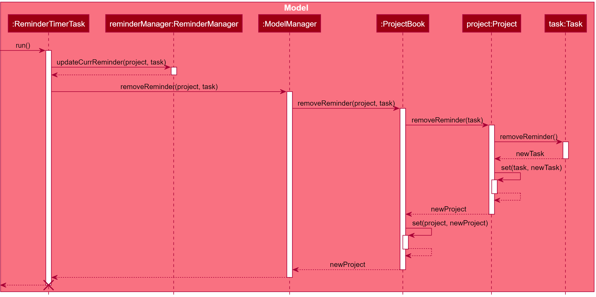

The result of the reminder is stored as a `StringProperty` in `ReminderManager`and retrieved from the `Model` so that a listener can be used in `MainWindow` to observe the `StringProperty` so that changes can be detected and the GUI can be updated acccordingly.

A `BooleanProperty` is also stored in `ReminderManager` to keep track of whether there are any reminders so that `MainWindow` can detect whether there are reminders and hide or show the reminder panel accordingly. This design was also chosen due to the ease of implementation.

### Statistics

//TODO: combine this section with the 1st section

#### Rescheduling Reminders

Whenever a project or task is added, edited or removed, the reminders needs to be adjusted accordingly. The chosen implementation is to reschedule all the reminders.

For example, the `PeriodicTotalTimeStatistic` calculates the amount of time the user
spends on each project within a specified [timeframe](#timeframes), and is calculated by looking at each project in the model and summing up all the durations spent working on the project for the given timeframe.

An alternative would be to only reschedule projects or tasks that are affected by the change. This design was not chosen as it is more complicated and would increase the coupling between `ReminderManager` and other related classes.

### Statistics

Momentum calculates statistics using the time tracking data collected from [timers and durations](#timers-and-durations).
These statistics are implemented using the command design pattern, similar to how Commands are implemented. Each statistic tracked by Momentum is represented by a `Statistic` object, and a `StatisticManager` contains all the statistics and is responsible for updating them whenever the model is changed.

Each statistic exposes a `calculate(Model model)` method that is called by the `StatisticManager` to calculate or update the data with the information in the model. The method contains instructions on how that particular statistic is calculated.

For example, the `PeriodicTotalTimeStatistic` calculates the amount of time the user
spends on each project within a specified [timeframe](#timeframes), and is calculated by looking at each project in the model and summing up all the durations spent working on the project for the given timeframe.

The statistics data is stored in each `Statistic` object as one or more `StatisticEntry` objects. A `StatisticEntry` represents a unit statistics data, which contains a `label` describing the data and the data's `value`.

Below is a sequence diagram to demonstrate how the statistics for time spent per project (weekly) is calculated and how the data is retrieved.

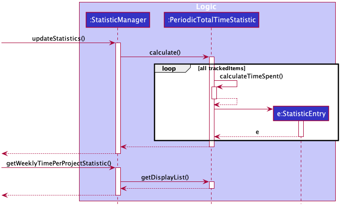

#### Timeframes

Momentum currently supports calculating statistics within the following timeframes:
* **Daily**: The period between midnight of the previous day, to the current time.
* **Weekly**: The period between midnight of the Monday of that week, to the current time.
* **Monthly**: The period between midnight of the 1st day of the month, to the current time.

The timeframe used to calculate statistics can be [set by the user](#settings).

### Managing Time
The `Clock` class acts as a consistent, single source of the current time within the application, and provides the  option to manually set and control the current time for testing purposes. Objects that need to know the current time must obtain it from `Clock`.

The `Clock` class has 3 modes that allow for it to perform different functions:

* **Normal**: The normal system time is returned.
* **Fixed**: The same, preset time is always returned. Used for testing purposes.
* **Manual**: The passage of time can be manually controlled, such as fast-forwarding and rewinding time by specific  amounts. Used for testing purposes.

This implementation was chosen because it allows all time-related features to be more easily testable.

#### Alternative Implementation: Using `LocalDateTime.now()` directly

This implementation was considered but ultimately rejected as it introduced several problems in testing time-related features. Notable issues are:

 * It is impossible to check for equality when getting system time directly using `LocalDateTime.now()` and other similar methods, since time would always progress by a small amount between each call.
 * It is difficult to test features that require the passage of time, such as the `start` and `stop` commands as we would need to actually wait an amount of time during the tests.

Below are some activity diagrams to illustrate the process of obtaining the current time from `Clock` in the various modes:

| 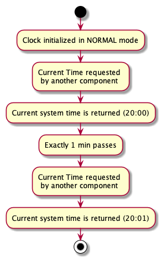 | 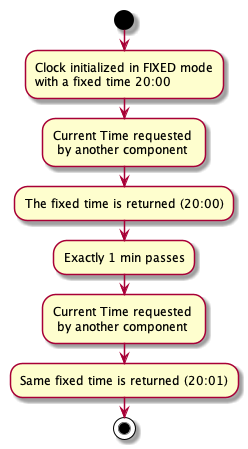 | 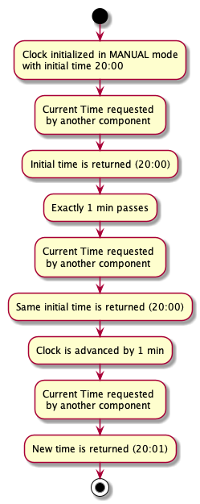|
|:---:|:---:|:---:|
|Normal|Fixed|Manual|

//TODO: capitalise Normal, ...

### Find Command

Momentum allows uses to search for tasks using the find command. Users can search for projects/tasks based on their name, description, tag and completion status. A FindType is included to determine whether any, all or none of the parameters need to match a project/task for it to be displayed.

A predicate is created for each type of search parameter (name, description, tags, completion status). There are four predicates classes defined for this purpose.

* `NameContainsKeywordPredicate` - Searches for projects/tasks based on name.
* `DescriptionContainsKeywordPredicate` - Searches for projects/tasks based on description.
* `TagListContainsKeywordPredicate` - Searches for projects/tasks based on tags.
* `CompletionStatusPredicate` - Searches for projects/tasks based on completion status.

Each of these predicate classes extends the abstract `ContainsKeywordPredicate` class which implements the `Predicate` interface. Each of these predicate classes takes in a match type, represented by the enumeration `FindType`.

The `ContainsKeywordPredicate` has a `testPredicate` method that is used or overridden by the subclasses. This method is used to test predicates based on the `FindType`.

The following class diagram shows the structure of the aforementioned classes.

//TODO: remove visibilities, remove findtype field, add association to findtype class instead, remove equals, include explanation for findtype

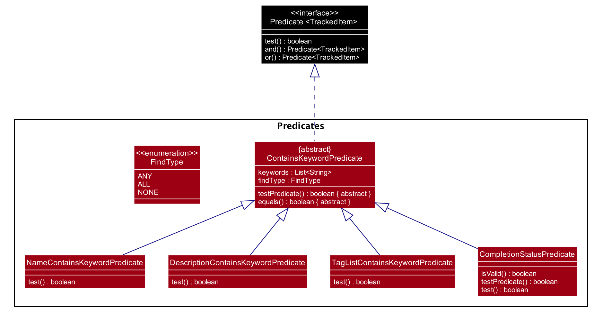

The `FindCommandParser` creates a list of predicates based on the arguments entered by the user. `FindCommandParser#combinePredicates` is then used to chain these predicates using the `Predicate#or` or `Predicate#and` methods depending on the `FindType` selected. This returns a `Predicate<TrackedItem> predicate`. The `FindCommand` will pass `predicate` into `Model#updatePredicate` to update the `displayList` once executed.

The following sequence diagram shows how the `FindCommandParser`works. Note that some details have been omitted from the diagram below for clarity.

//TODO: remove valueOf method call, change FindType return to findType, use a specific e.g.

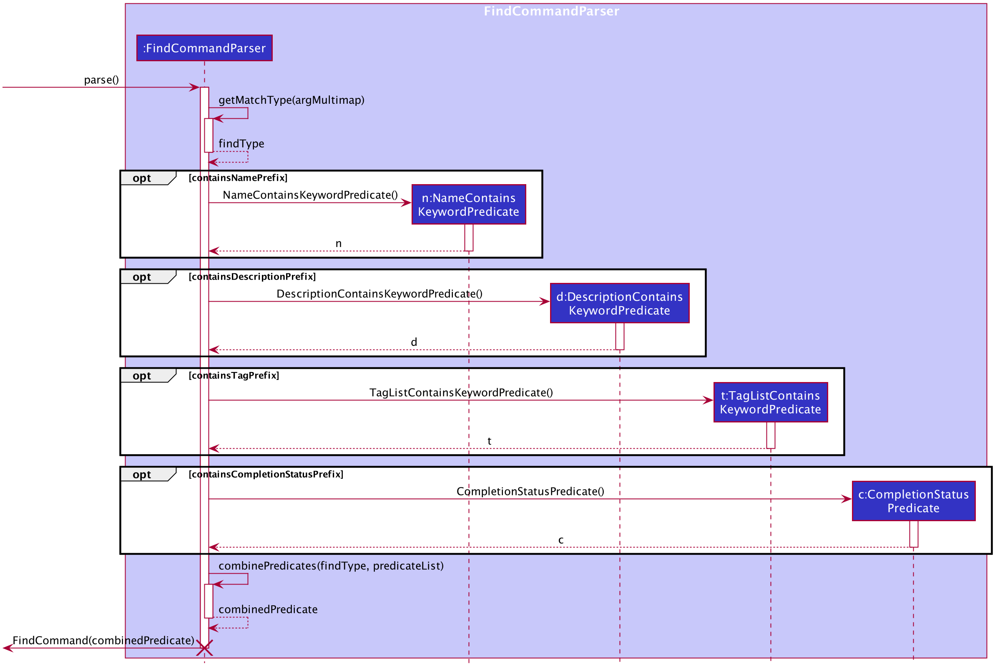

The process of creating and chaining predicates varies based on the `FindType` selected. The following activity diagrams show this process for each `FindType`.

| 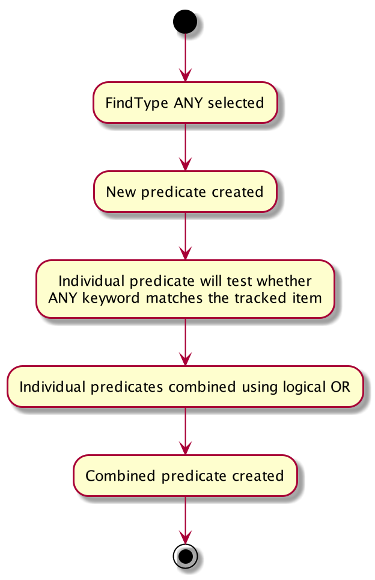 | 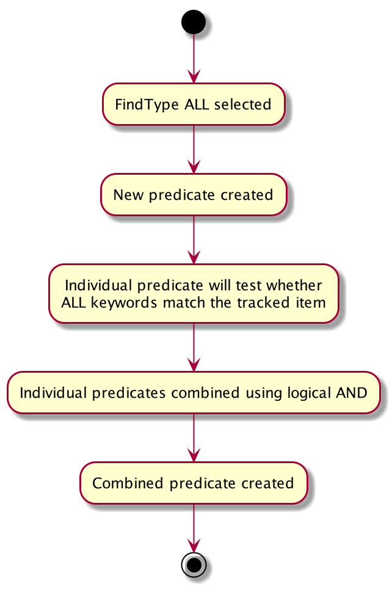 | |
|:---:|:---:|:---:|
|Find Any|Find All|Find None|

Note that `FindType.NONE` uses the logical AND when combining predicates. This is because individual predicates test for a negative match result. These negative results need to be chained together using the logical AND because a negative match requires a project to not match every keyword.

This design was chosen as it built on the existing implementation of the find command, which passed a `NameContainsKeywordPredicate` to the `displayList`. This means that minimal changes to other parts of the project were required.

#### Alternative implementation: Using a custom predicate class

We considered using a custom predicate class to contain all predicates in a separate `MomentumPrediate` interface.

This implementation was ultimately rejected as it introduced unnecessary complexities with Predicate chaining. The `MomentumPredicate` interface will need to override `Predicate#and` and `Predicate#or` with our custom implementation.

### Settings

Currently, Momentum allows the GUI theme and the statistics timeframe to be adjusted by the user. This is done using the set command.

#### Set Command

The command works by first creating and filling up a `SettingsToChange` object with the settings given by the user, and then identifying what will be changed. The necessary methods in `Model` such as `setGuiThemeSettings` or `setStatisticTimeframeSettings` will be called to update the settings.

The settings changed by the user will also reflect immediately in the application. This is handled by [`SettingsUpdateManager`](#settings-update-manager), which is called during the execution of the command.

The following sequence diagram shows how the set command works.
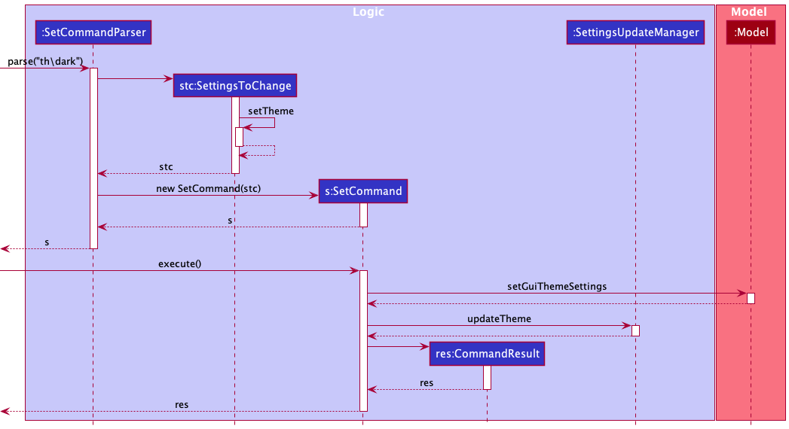

#### Updating and Saving User Prefs

Settings are saved by updating `GuiThemeSettings` and/or `StatisticTimeframeSettings` in `UserPrefs` in the application model. All class attributes in `UserPrefs` are serializable, so that all settings in `UserPrefs` can be saved in `preferences.json` when the user exits the application. Serialization is done using `JsonUserPrefsStorage#saveUserPrefs`.

Below is the class diagram of `UserPrefs`.

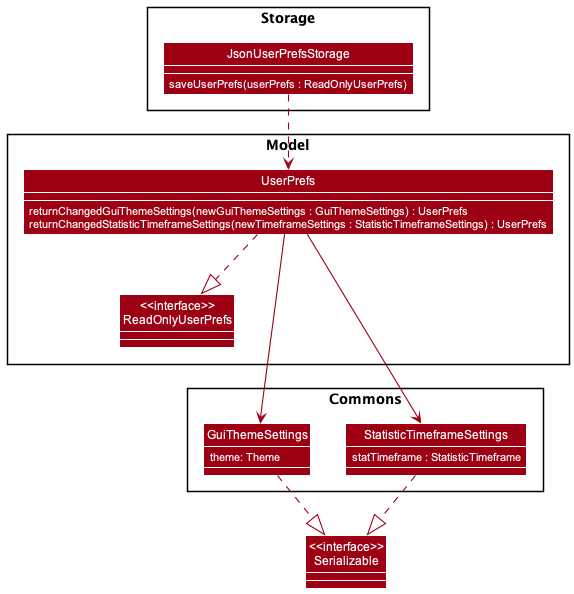

Model manager will call on `UserPrefs#returnChangedGuiThemeSettings` or `UserPrefs#returnChangedStatisticTimeframeSettings` when updating the settings. Notice that the two methods will return a new `UserPrefs`. This design is chosen so as to support [`Undo/Redo`](#undoredo-feature), where versions can be placed on the different instances of `UserPrefs`.

#### Settings Update Manager

`SettingsUpdateManager` is a class that assists in updating the application instance with the new settings when there are changes made to `UserPrefs`.

Currently, the user adjustable settings are the GUI theme and the timeframe of the statistics shown. Hence, `SettingsUpdateManager` takes in a `Ui`, and a `StatisticGenerator` as attributes in order to update them.

`SettingsUpdateManager#updateTheme` and `SettingsUpdateManager#updateStatisticTimeFrame` are designed to handle null cases of `Ui` and `StatisticGenerator` so as to make testing more convenient. This is because there are methods being tested that will indirectly call the above methods. Allowing `Ui` and `StatisticGenerator` to be null will enable them to not be instantiated in the tests.

It is also worth noting that all attributes and methods in `SettingUpdateManager` are class-level instead of instance-level. This design was chosen so as to allow minimal changes to the code base. However, one con of this design will be that the attributes and methods can be set or called from anywhere in the code. 

##### Alternative Implementation of `SettingsUpdateManager`
An alternative implemention of `SettingsUpdateManager` is to convert all of the class-level attributes and methods to become instance-level. While this can address the con mentioned above, having to pass an instantiated `SettingsUpdateManager` object around now will require some undesirable changes to be made. Below describe the possible ways to pass a `SettingsUpdateManager` object around and it's undesired effects.

* Include `SettingsUpdateManager` as an attribute in `ModelManager`:
  * As `Model` is only meant to hold data of the app, putting `SettingUpdateManager` in `ModelManager` is not ideal.
* Include `SettingsUpdateManager` as an attribute in `LogicManager`:
  * With the current code design, in order for `SetCommand` to be able to use `SettingsUpdateManager`, it is required that `SettingsUpdateManager` is passed in as an argument in `SetCommand#execute` when the method is called by `LogicManager`. This will require changes to be made to the abstract `Command` superclass' `execute` method, and is also an undesirable design as all commands will now be aware of `SettingsUpdateManager` when `SetCommand` is the only command using it.

#### Alternative implementation of Settings Feature
An alternative way to implement the settings feature is to not make the settings reflect immediately. Instead, the user will have to restart the application for the settings to take effect. While it will be much easier to implement since it will only require updating `UserPrefs`, it will not provide a good user experience.

### Sort Command

The sort command uses comparators to order the list of projects/tasks.

// TODO: include intro, explain sort types, activity diagram

* `CompletionStatusCompare` - Comparator that compares the completion status of two tasks. This is a comparator that imposed a sort order on top of other comparators, which means that all incomplete projects/tasks are shown at the top of the list ordered in the specified orders, and all complete projects/tasks are shown at the bottom, also ordered in the specified order. This sort order is imposed by default, and can be toggled on and off.
* `CreatedDateCompare` - Comparator that compares the created date of two tasks, then the alphabetical names of two tasks if created dates are the same.
* `NameCompare` - Comparator that compares the alphabetical names of two tasks.
* `DeadlineCompare` - Comparator that compares the deadlines of two tasks, then the alphabetical names of two tasks if deadlines are the same.

#### Design Details

* The `SortCommandParser` passes sort values (Sort type, whether it is in ascending order, whether the default ordering of completion status) to the `ModelManager`.
* The comparators are then generated according to these values and sort order is imposed on the list of projects/tasks based on the comparator. `ModelManager` stores the information of the latest sort order imposed so that the sort order can be maintained.

* All comparators extend the class `Comparator<TrackedItem>` except `DeadlineCompare`, which extends the class `Comparator<HashMap<String, Object>>`.

  * This is because for all other attributes such as name, completion status and created date, it is guaranteed that every TaskItem will have a non-null value, however it is possible that a project or a task has no deadline.
  * Therefore, I decided to use `Comparator.nullsLast` to place the project/tasks with no deadlines at the end of the list if the list is to be sorted by deadline. Those with deadlines will then be compared by passing in their deadline and name details to a `HashMap` which is then compared using `DeadlineCompare`.

//TODO: change I

### Undo/Redo feature

The undo/redo command allows users to step through their history log of Momentum, such that they can undo commands they have excecuted wrongly, or redo commands that they have previously undone.

#### Chosen Implementation

The undo/redo implementation is as such:
 * Create a `VersionedProjectBook` which extends `ProjectBook` with an undo/redo history log
 * The history of `VersionedProjectBook` is stored as a `projectBookStateList` containing versions of `ProjectBookWithUi` and a `currentStatePointer`. Users are able to go back to a particular point in their history log by shiting the `currentStatePointer`.
    * The need for an additional class `ProjectBookWithUi` comes from the need to store UI details that need to be reset in `ModelManager` class in addition to the resetting of `ProjectBook` data done by undo/redo within `VersionedProjectBook` class.

 The `VersionedProjectBook` implements the following operations to facilitate the storing and traversing of history:

* `VersionedProjectBook#commit()` — Saves the current project book state in its `projectBookStateList` as a `ProjectBookWithUi` object.
* `VersionedProjectBook#undo()` — Resets the project book data with data from the previous project book state in its history.
* `VersionedProjectBook#redo()` — Resets the project book data with data from a previously undone project book state in its history.

The above operations are exposed in the `Model` interface as `Model#commitToHistory()`, `Model#undoCommand()` and `Model#redoCommand()` respectively.

An example usage scenario has been provided below to demonstrate the undo/redo mechanism.

Step 1. The user launches the application for the first time. The `VersionedProjectBook` is initialized with the initial project book state, and the state is added to the `projectBookStateList` with the `currentStatePointer` pointing to that state.

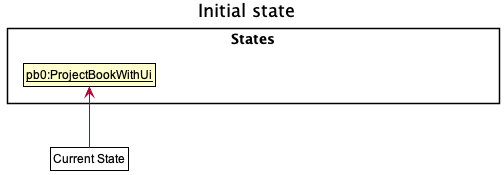

Step 2. The user executes `delete 2` command to delete the 2nd project in the project book. The `delete` command calls `Model#commitToHistory`, which adds the new state of the project book after the execution of `delete 2` command as `ProjectBookWithUi` in the `projectBookStateList`. After every new command (excluding undo, redo, and help), the `currentStatePointer` is shifted to the most recent project book state.

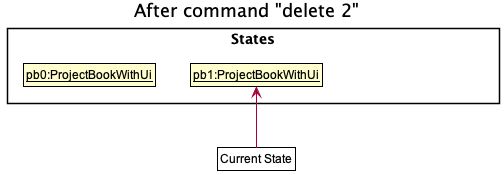

Step 3. The user executes `add n/Design Webpage for XYZ​` to add a new project. The `add` command also calls `Model#commitProjectBook()`, which similarly adds the new state of the project book after the execution of `add n/Design Webpage for XYZ​` command as `ProjectBookWithUi` in the `projectBookStateList`.

:information_source: <strong>Note:</strong> If a command fails its execution, `Model#commitProjectBook()` is not called. Project book state will not be saved into the `projectBookStateList`.

//TODO: change projectbook names pb

Step 4. If user wants undo that action due to some errors in the information, they can do so by executing the `undo` command. The `undo` command calls `Model#undoCommand()`, which resets the current project book with the data from the previous project book state. This is done after `currentStatePointer` is shifted once to the left.

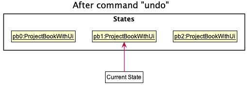

:information_source: <strong>Note:</strong> If the `currentStatePointer` is at index 0, meaning there is no history to traverse back in time, then the `undo` command will throw an exception that informs user that there is no command to undo. This is done after checking that there is no history to go back to using `Model#canUndoCommand()`.

:information_source: <strong>Note:</strong> Help and Exit commands does not call `Model#commitProjectBook()` as these command will not cause any project book changes in terms of data or UI.

The following sequence diagram shows how the undo operation works:

:information_source: <strong>Note:</strong> The lifeline for `UndoCommand` should end at the destroy marker (X) but due to a limitation of PlantUML, the lifeline reaches the end of diagram.

//TODO: add this alert to other parts

The `redo` command does the opposite — it calls `Model#redoCommand()`, which shifts the `currentStatePointer` once to the right, pointing to the previously undone state, and resets the current project book with the data from the next project book state.

:information_source: <strong>Note:</strong> If the `currentStatePointer` is at index `projectBookStateList.size() - 1`, meaning there is no history to move forward to (undo has not been executed), then the `redo` command will throw an exception that informs user that there is no command to redo. This is done after checking that there is no history to move forward to using `Model#canRedoCommand()`

Step 5. If the user changes their mind and decides that the error is minor and wish to redo the previously undone command, they can do so by executing the `redo` command. The `redo` command calls `Model#redoCommand()`, which resets the current project book with the data from the next project book state. This is done after `currentStatePointer` is shifted once to the right.

Step 6. If the user changes their mind once again and decides to go with undo, they can do so by executing the `undo` command again.

Step 7. The user executes `clear`, which calls `Model#commitProjectBook()`. Because the `currentStatePointer` is not the most recent state in `projectBookStateList`, all project book states after the `currentStatePointer` will be flushed. This is to maintain a single history of states based on executed commands.

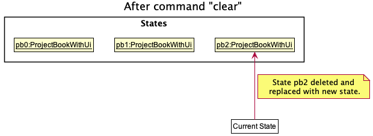

The following activity diagram summarizes what happens when a user executes a new command (that is not undo, redo, help, or exit):

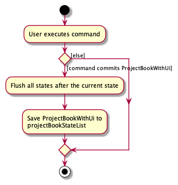

#### Alternative Implementation: Saving commands instead of entire project book

This would allow users to go back in history through a reversal of command once a command is undone.

Because this stores a history of commands and versions of the entire project book, it takes up less memory in users' devices and as a result would have performance gains.

This was a candidate for implementation but ultimately rejected due to the following concerns:

* It is difficult to implement the reversal of every command.

  * We have added many new features and commands, hence it would take time to implement the reversal of each command. It would be wiser to spend the time on improving our existing features.

* This would be more prone to bugs due to the compulsory implementation of reversal of every command.

---

## **Documentation, logging, testing, configuration, dev-ops**

* [Documentation guide](Documentation.md)
* [Testing guide](Testing.md)
* [Logging guide](Logging.md)
* [Configuration guide](Configuration.md)
* [DevOps guide](DevOps.md)

---

## **Appendix: Requirements**

### Product scope

**Target user profile**:

* Freelancers
  * Freelancers may take on multiple projects simultaneously, so they need to manage and track the time they spend on each project.
  * Freelancers want to know how much time they spend on a project in order to accurately bill their clients and set future rates.
  * Freelancers might want to know more about how they distribute their time and track the time spent on each project so that they can better understand their working style, and plan their time more efficiently.

**Value proposition**:

* Time tracking app
  * Dashboard view for freelancer to get an overview of all projects.
  * Multiple groups to represent different categories to help in grouping of tasks such as freelance projects.
  * Predefined groups that are commonly used for freelancers, such as projects and self-learning/improvement.
  * Timer to track the duration of a task or Indicate start time and end time for a task, so that the user can price their rates and charge clients more accurately.
  * Reminder for a project (only when application is open).
  * Interesting/creative views for visualizing the data.

### User stories

Priorities: High (must have) - `* * *`, Medium (nice to have) - `* *`, Low (unlikely to have) - `*`

| Priority | As a …​                                     | I want to …​                         | So that I can…​                                                         |
| -------- | ------------------------------------------- | ------------------------------------ | ----------------------------------------------------------------------- |
| `* * *`  | new user                                    | see usage instructions               | refer to instructions when I forget how to use the App                  |
| `* * *`  | user                                        | add a new project/task                    |                                                                    |
| `* * *`  | user                                        | view the project/task's creation date                    | know when I started tracking that project/task      |
| `* * *`  | user                                        | view the project/task's completion status                    | check if I have completed a project/task        |
| `* * *`  | user                                        | add and edit a deadline for a project/task                    | know when I need to finish the project/task    |
| `* * *`  | user                                        | add and edit a reminder for a project/task                    | remind myself to do important projects/tasks   |
| `* * *`  | user                                        | delete a project/task                     | remove entries that I no longer need                                    |
| `* * *`  | user                                        | find a project/task by name              | locate projects/task by name without having to go through the entire list     |
| `* * *`  | user                                        | find a project/task by description               | locate projects/tasks by description without having to go through the entire list |
| `* * *`  | user                                        | find a project/task by tag               | locate projects/tasks by tag without having to go through the entire list |
| `* * *`  | user                                        | find a project/task by completion status               | locate projects/tasks that are completed or incomplete without having to go through the entire list |
| `* * *`  | user                                        | find a project/task by multiple parameters               | locate details of projects/tasks without having to go through the entire list |
| `*`      | user with many projects in Momentum         | sort projects/tasks by name                | locate a project/task easily                                                 |
| `*`      | user with many projects in Momentum         | sort projects/tasks by completion status                | locate an incomplete or complete project/task easily                                                 |
| `*`      | user with many projects in Momentum         | hide and show the tags panel                | focus more on statistics and timers                                                 |
| `*`      | user with many projects in Momentum         | dismiss the reminder                | focus more on statistics and timers                                                 |
| `* *`    | new user                                    | start and stop a timer for a project/task | track the time I spent on the project/task                                   |
| `* *`    | user                                        | see the amount of time I spend on each project/task | gain insights on how I am using my time |
| `* *`    | user                                        | can create tasks within a project    | better organize my work

### Use cases

(For all use cases below, the **System** is the `Momentum` and the **Actor** is the `user`, unless specified otherwise)

#### **Use case: Start and End a Timer**

**MSS**

1.  User requests to start a timer for a specific project in the list.
2.  Momemtum starts the timer for the project.
3.  User requests to end a timer for a specific project in the list.
4.  Momemtum ends the timer for the project.

**Extensions**

* 2a. There is an existing timer for the given project id.

  * a1. Momentum shows an error message.

    Use case ends.

* 3a. There is no ongoing timer for the given project id.

  * a1. Momentum shows an error message.

    Use case ends.

* *a. The given project id is invalid.

  * a1. Momentum shows an error message.

    Use case ends.

####**Use case: Add a project**

**MSS**

1. User requests to add a project with a name, a description, a deadline, a completion status, a reminder and a tag.
2. Momentum shows a command result and updates the project list shown to reflect the addition.
3. Momentum shows the name of the project in the reminder panel and remove the reminder of the project at the date and time of the reminder specified.
4. User requests to <u>[dismiss the reminder](#use-case-dismiss-a-reminder)</u>.

//TODO: make 3 a use case for reminder and dismiss

**Extensions**

* 2a. Momentum detects an error in the user input or a duplicate project in the project list.

  * a1. Momentum shows an error message.

  Use case ends.

The use cases for editing a project, adding a task and editing a task is similar to adding a project, except that the error messages differ slightly.

#### **Use case: Dismiss a Reminder**

1. User requests to dismiss a reminder.
2. Momentum hides the reminder panel.

  Use case ends.

#### **Use case: Hide the Tags Panel**

1. User requests to hide the tags panel.
2. Momentum hides the tags panel.

  Use case ends.

#### **Use case: Delete a project**

**MSS**

1. User requests to list projects.
2. Momentum shows a list of projects.
3. User requests to delete a specific project in the list.
4. Momentum deletes the project.

    Use case ends.

The use cases for deleting a task is similar to deleting a project.

//TODO: add use cases

**Extensions**

* 3a. The given project id is invalid.

  * a1. Momentum  shows an error message.

    Use case ends.

####**Use case: Find a project/task in the list**

**MSS**

1.  User requests to filter the projects/tasks displayed based on certain parameters.
2.  Momemtum filters the list of projects displayed.

**Extensions**

* 2a. There is no project/task that matches the specified parameters.

  * a1. Momentum shows an empty list.

    Use case ends.

* *a. The arguments are given in an incorrect format.

  * a1. Momentum shows an error message.

    Use case ends.

####**Use case: View a project's tasks**

**MSS**

1. User requrests to view the tasks belonging to a project.
2. Momentum shows a list of tasks belonging to the project.

**Extensions**

* *a. The arguments are given in an incorrect format.

  * a1. Momentum shows an error message.

    Use case ends.

### Non-Functional Requirements

1.  Should work on any _mainstream OS_ as long as it has Java `11` or above installed.
2.  Should be able to hold up to 1000 projects without a noticeable sluggishness in performance for typical usage.
3.  A user with above average typing speed for regular English text (i.e. not code, not system admin commands) should be able to accomplish most of the tasks faster using commands than using the mouse.

### Glossary

* **Command Line Interface(CLI)**: Command Line Interface processes commands in the form of text
* **Mainstream OS**: Windows, Linux, Unix, OS-X
* **Project View**: View all projects in the project book.
* **Task View**: View all tasks that are added to a single project.

---

## **Appendix: Instructions for manual testing**

Given below are instructions to test the app manually.

:information_source: <strong>Note:</strong> These instructions only provide a starting point for testers to work on;
testers are expected to do more *exploratory* testing.

### Launch and shutdown

1. Initial launch

   1. Download the jar file and copy into an empty folder

   1. Double-click the jar file Expected: Shows the GUI with a set of sample contacts. The window size may not be optimum.

1. Saving window preferences

   1. Resize the window to an optimum size. Move the window to a different location. Close the window.

   1. Re-launch the app by double-clicking the jar file. 
      Expected: The most recent window size and location is retained.

### Saving data

1. Dealing with missing data files

   1. Delete the existing `projectbook.json` file

   1. Re-launch the app by double-clicking the jar file. 
      Expected: The project book is initalized with default data.

1. Dealing with corrupted data files

   1. Corrupt the values inside the existing `projectbook.json` file by changing the name `projects` in to `rojects`

   1. Re-launch the app by double-clicking the jar file. 
      Expected: The project book is initalized with no data.

### Add a project

1. Adding a project while all projects are shown.

    1. Prerequisites: List all projects using the `list` command. Multiple projects in the list.

    1. Test case: `add n/project1` 
    Expected: A new project with the name `project1` will be created. Details of the project shown in the status message.

    1. Test case: `add n/project2 d/desc2` 
    Expected: A new project with the name `project2` and description `desc2` will be created. Details of the project shown in the status message.

    1. Test case: `add n/project3 t/tagA t/tagB` 
    Expected: A new project with the name `project3` and tags `tagA` and `tagB` will be created. Details of the project shown in the status message.

    1. Test case: `add n/project4 c/` 
    Expected: A new project with the name `project4` and completion status `done` will be created. Details of the project shown in the status message.

    1. Test case: `add n/project5 dd/2020-12-21` 
    Expected: A new project with the name `project5` and deadline date `2020-12-21` will be created. Details of the project shown in the status message.

    1. Test case: `add n/project6 dd/2020-12-21 dt/12:34:56` 
    Expected: A new project with the name `project5` and deadline date `2020-12-21` and deadline time `12:34:56` will be created. Details of the project shown in the status message.

    1. Test case: `add n/project7 r/x` where `x` is a time later that the current time in the `YYYY-MM-DDTHH:MM:SS` format. 
    Expected: A new project with the name `project6` and a reminder scheduled at time `x` will be created. Details of the project shown in the status message.

1. Adding a project while only some projects are shown.

    1. Prerequisites: List only some projects using the `find` command.

    1. Test case: `add n/project1` 
    Expected: A new project with the name `project1` will be created. Details of the project shown in the status message. View will be reset and all projects should be shown.

    1. Test case: `add n/project2 d/desc2` 
    Expected: A new project with the name `project2` and description `desc2` will be created. Details of the project shown in the status message. View will be reset and all projects should be shown.

    1. Test case: `add n/project3 t/tagA t/tagB` 
    Expected: A new project with the name `project3` and tags `tagA` and `tagB` will be created. Details of the project shown in the status message. View will be reset and all projects should be shown.

    1. Test case: `add n/project4 c/` 
    Expected: A new project with the name `project4` and completion status `done` will be created. Details of the project shown in the status message. View will be reset and all projects should be shown.

    1. Test case: `add n/project5 dd/2020-12-21` 
    Expected: A new project with the name `project5` and deadline date `2020-12-21` will be created. Details of the project shown in the status message. View will be reset and all projects should be shown.

    1. Test case: `add n/project6 dd/2020-12-21 dt/12:34:56` 
    Expected: A new project with the name `project5` and deadline date `2020-12-21` and deadline time `12:34:56` will be created. Details of the project shown in the status message. View will be reset and all projects should be shown.

    1. Test case: `add n/project7 r/x` where `x` is a time later that the current time in the `YYYY-MM-DDTHH:MM:SS` format. 
    Expected: A new project with the name `project6` and a reminder scheduled at time `x` will be created. Details of the project shown in the status message. View will be reset and all projects should be shown.

1. Adding a project with invalid inputs parameters.

    1. Prerequisites: List all projects using the `list` command. Multiple projects in the list.

    1. Test case: `add n/$$` 
    Expected: A new project will not be created. Invalid name format message shown in the status message.

    1. Test case: `add n/project3 t/invalid tag` 
    Expected: A new project will not be created. Invalid name format message shown in the status message.

    1. Test case: `add n/project5 dd/2020-21-12` 
    Expected: A new project will not be created. Invalid date format message shown in the status message.

    1. Test case: `add n/project6 dd/2020-12-21 dt/99:99:99` 
    Expected: A new project will not be created. Invalid time format message shown in the status message.

    1. Test case: `add n/project7 r/x` where `x` is a time earlier that the current time in the `YYYY-MM-DDTHH:MM:SS` format. 
    Expected: A new project will not be created. Invalid reminder date and time message shown in the status message.

### Edit a project

1. Editing a project while all projects are shown.

    1. Prerequisites: List all projects using the `list` command. Multiple projects in the list.

    1. Test case: `edit x n/project1` where `x` is the index of a project in the list. 
    Expected: The project at index `x` will be edited to have the name `project1` Details of the edited project shown in the status message.

    1. Test case: `edit x d/desc2` where `x` is the index of a project in the list. 
    Expected: The project at index `x` will be edited to have the description `desc2`. Details of the edited project shown in the status message.

    1. Test case: `edit x t/tagA t/tagB` where `x` is the index of a project in the list. 
    Expected: The project at index `x` will be edited to have the tags `tagA` and `tagB`. Details of the edited project shown in the status message.

    1. Test case: `edit x c/` where `x` is the index of a project in the list. 
    Expected: The project at index `x` will be edited to have the completion status `done`. Details of the edited project shown in the status message.

    1. Test case: `edit x dd/2020-12-21` where `x` is the index of a project in the list. 
    Expected: The project at index `x` will be edited to have the deadline date `2020-12-21`. Details of the edited project shown in the status message.

    1. Test case: `edit x dd/2020-12-21 dt/12:34:56` where `x` is the index of a project in the list. 
    Expected: The project at index `x` will be edited to have thr deadline date `2020-12-21` and deadline time `12:34:56`. Details of the edited project shown in the status message.

    1. Test case: `edit x r/y` where `x` is the index of a project in the list and `y` is a time later that the current time in the `YYYY-MM-DDTHH:MM:SS` format. 
    Expected: The project at index `x` will be edited to have the name `project6` and a reminder scheduled at time `y`. Details of the edited project shown in the status message.

1. Editing a project while only some projects are shown.

    1. Prerequisites: List only some projects using the `find` command.

    1. Test case: `edit x n/project1` where `x` is the index of a project in the list. 
    Expected: The project at index `x` will be edited to have the name `project1` Details of the edited project shown in the status message. View will persist and only some projects should be shown.

    1. Test case: `edit x d/desc2` where `x` is the index of a project in the list. 
    Expected: The project at index `x` will be edited to have the description `desc2`. Details of the edited project shown in the status message. View will persist and only some projects should be shown.

    1. Test case: `edit x t/tagA t/tagB` where `x` is the index of a project in the list. 
    Expected: The project at index `x` will be edited to have the tags `tagA` and `tagB`. Details of the edited project shown in the status message. View will persist and only some projects should be shown.

    1. Test case: `edit x c/` where `x` is the index of a project in the list. 
    Expected: The project at index `x` will be edited to have the completion status `done`. Details of the edited project shown in the status message. View will persist and only some projects should be shown.

    1. Test case: `edit x dd/2020-12-21` where `x` is the index of a project in the list. 
    Expected: The project at index `x` will be edited to have the deadline date `2020-12-21`. Details of the edited project shown in the status message. View will persist and only some projects should be shown.

    1. Test case: `edit x dd/2020-12-21 dt/12:34:56` where `x` is the index of a project in the list. 
    Expected: The project at index `x` will be edited to have thr deadline date `2020-12-21` and deadline time `12:34:56`. Details of the edited project shown in the status message. View will persist and only some projects should be shown.

    1. Test case: `edit x r/y` where `x` is the index of a project in the list and `y` is a time later that the current time in the `YYYY-MM-DDTHH:MM:SS` format. 
    Expected: The project at index `x` will be edited to have the name `project6` and a reminder scheduled at time `y`. Details of the edited project shown in the status message. View will persist and only some projects should be shown.

1. Editing a project with invalid inputs parameters.

    1. Prerequisites: List all projects using the `list` command. Multiple projects in the list.

    1. Test case: `edit x n/$$` where `x` is the index of a project in the list. 
    Expected: The project at index `x` will not be edited. Invalid name format message shown in the status message.

    1. Test case: `edit x t/invalid tag` where `x` is the index of a project in the list. 
    Expected: The project at index `x` will not be edited. Invalid tag format message shown in the status message.

    1. Test case: `edit x dd/2020-21-12` where `x` is the index of a project in the list. 
    Expected: The project at index `x` will not be edited. Invalid date format message shown in the status message.

    1. Test case: `edit x dd/2020-12-21 dt/99:99:99` where `x` is the index of a project in the list. 
    Expected: The project at index `x` will not be edited. Invalid time format message shown in the status message.

    1. Test case: `edit x r/y` where `x` is the index of a project in the list and `y` is a time later that the current time in the `YYYY-MM-DDTHH:MM:SS` format. 
    Expected: The project at index `x` will not be edited. Invalid reminder date and time message shown in the status message.

### Delete a project

1. Deleting a project while all projects are shown.

    1. Prerequisites: List all projects using the `list` command. Multiple projects in the list.

    1. Test case: `delete 1` 
    Expected: The first project in the list will be deleted. Details of the deleted project shown in the status message.

    1. Test case: `delete 0`, `delete` 
    Expected: No project will be deleted. Invalid command format message shown. No change to the list of projects.

    1. Test case: `delete x`, where x is greater than the number of projects 
    Expected: No project will be deleted. Invalid index message shown.

1. Deleting a project while only some projects are being shown.

    1. Prerequisites: Find some projects using the `find` command. Multiple projects in the filtered list.

    1. Test case: `delete 1` 
    Expected: First project in the filtered list will be deleted. Details of the deleted project shown in the status message.

    1. Test case: `delete 0`, `delete` 
    Expected: No project will be deleted. Invalid command format message shown. No change to the list of projects.

    1. Test case: `delete x`, where x is greater than the number of projects 
    Expected: No project will be deleted. Invalid index message shown.

1. Deleting a project while only one project is being shown.

    1. Prerequisites: Find a single project using the `find` command. Only one project in the filtered list.

    1. Test case: `delete 1` 
    Expected: First project in the filtered list will be deleted. Details of the deleted project shown in the status message. The filtered list will be empty. Application will not revert to an unfiltered list.

    1. Test case: `delete 0`, `delete` 
    Expected: No project will be deleted. Invalid command format message shown. No change to the list of projects.

    1. Test case: `delete x`, where x is greater than the number of projects 
    Expected: No project will be deleted. Invalid index message shown.

### Clear all projects

1. Clearing projects when all projects are shown.

    1. Prerequisites: List all projects using the `list` command. Multiple projects in the list.

    1. Test case: `clear` 
    Expected: All projects and tasks in the project book will be deleted.

1. Clearing projects when only some projects are shown.

    1. Prerequisites: Find some projects using the `find` command. Multiple projects in the filtered list.

    1. Test case: `clear` 
    Expected: All projects and tasks in the project book will be deleted.

### Add a task

1. Adding a task while all tasks are shown.

    1. Prerequisites: Viewing tasks for any project. List all tasks using the `list` command. Multiple tasks in the list.

    1. Test case: `add n/task1` 
    Expected: A new task with the name `task1` will be created. Details of the task shown in the status message.

    1. Test case: `add n/task2 d/desc2` 
    Expected: A new task with the name `task2` and description `desc2` will be created. Details of the task shown in the status message.

    1. Test case: `add n/task3 t/tagA t/tagB` 
    Expected: A new task with the name `task3` and tags `tagA` and `tagB` will be created. Details of the task shown in the status message.

    1. Test case: `add n/task4 c/` 
    Expected: A new task with the name `task4` and completion status `done` will be created. Details of the task shown in the status message.

    1. Test case: `add n/task5 dd/2020-12-21` 
    Expected: A new task with the name `task5` and deadline date `2020-12-21` will be created. Details of the task shown in the status message.

    1. Test case: `add n/task6 dd/2020-12-21 dt/12:34:56` 
    Expected: A new task with the name `task5` and deadline date `2020-12-21` and deadline time `12:34:56` will be created. Details of the task shown in the status message.

    1. Test case: `add n/task7 r/x` where `x` is a time later that the current time in the `YYYY-MM-DDTHH:MM:SS` format. 
    Expected: A new task with the name `task6` and a reminder scheduled at time `x` will be created. Details of the task shown in the status message.

1. Adding a task while only some tasks are shown.

    1. Prerequisites: Viewing tasks for any project.List only some tasks using the `find` command.

    1. Test case: `add n/task1` 
    Expected: A new task with the name `task1` will be created. Details of the task shown in the status message. View will be reset and all tasks should be shown.

    1. Test case: `add n/task2 d/desc2` 
    Expected: A new task with the name `task2` and description `desc2` will be created. Details of the task shown in the status message. View will be reset and all tasks should be shown.

    1. Test case: `add n/task3 t/tagA t/tagB` 
    Expected: A new task with the name `task3` and tags `tagA` and `tagB` will be created. Details of the task shown in the status message. View will be reset and all tasks should be shown.

    1. Test case: `add n/task4 c/` 
    Expected: A new task with the name `task4` and completion status `done` will be created. Details of the task shown in the status message. View will be reset and all tasks should be shown.

    1. Test case: `add n/task5 dd/2020-12-21` 
    Expected: A new task with the name `task5` and deadline date `2020-12-21` will be created. Details of the task shown in the status message. View will be reset and all tasks should be shown.

    1. Test case: `add n/task6 dd/2020-12-21 dt/12:34:56` 
    Expected: A new task with the name `task5` and deadline date `2020-12-21` and deadline time `12:34:56` will be created. Details of the task shown in the status message. View will be reset and all tasks should be shown.

    1. Test case: `add n/task7 r/x` where `x` is a time later that the current time in the `YYYY-MM-DDTHH:MM:SS` format. 
    Expected: A new task with the name `task6` and a reminder scheduled at time `x` will be created. Details of the task shown in the status message. View will be reset and all tasks should be shown.

1. Adding a task with invalid inputs parameters.

    1. Prerequisites: Viewing tasks for any project. List all tasks using the `list` command. Multiple tasks in the list.

    1. Test case: `add n/$$` 
    Expected: A new task will not be created. Invalid name format message shown in the status message.

    1. Test case: `add n/task3 t/invalid tag` 
    Expected: A new task will not be created. Invalid name format message shown in the status message.

    1. Test case: `add n/task5 dd/2020-21-12` 
    Expected: A new task will not be created. Invalid date format message shown in the status message.

    1. Test case: `add n/task6 dd/2020-12-21 dt/99:99:99` 
    Expected: A new task will not be created. Invalid time format message shown in the status message.

    1. Test case: `add n/task7 r/x` where `x` is a time earlier that the current time in the `YYYY-MM-DDTHH:MM:SS` format. 
    Expected: A new task will not be created. Invalid reminder date and time message shown in the status message.

### Edit a task

1. Editing a task while all tasks are shown.

    1. Prerequisites: Viewing tasks for any project. List all tasks using the `list` command. Multiple tasks in the list.

    1. Test case: `edit x n/task1` where `x` is the index of a task in the list. 
    Expected: The task at index `x` will be edited to have the name `task1` Details of the edited task shown in the status message.

    1. Test case: `edit x d/desc2` where `x` is the index of a task in the list. 
    Expected: The task at index `x` will be edited to have the description `desc2`. Details of the edited task shown in the status message.

    1. Test case: `edit x t/tagA t/tagB` where `x` is the index of a task in the list. 
    Expected: The task at index `x` will be edited to have the tags `tagA` and `tagB`. Details of the edited task shown in the status message.

    1. Test case: `edit x c/` where `x` is the index of a task in the list. 
    Expected: The task at index `x` will be edited to have the completion status `done`. Details of the edited task shown in the status message.

    1. Test case: `edit x dd/2020-12-21` where `x` is the index of a task in the list. 
    Expected: The task at index `x` will be edited to have the deadline date `2020-12-21`. Details of the edited task shown in the status message.

    1. Test case: `edit x dd/2020-12-21 dt/12:34:56` where `x` is the index of a task in the list. 
    Expected: The task at index `x` will be edited to have thr deadline date `2020-12-21` and deadline time `12:34:56`. Details of the edited task shown in the status message.

    1. Test case: `edit x r/y` where `x` is the index of a task in the list and `y` is a time later that the current time in the `YYYY-MM-DDTHH:MM:SS` format. 
    Expected: The task at index `x` will be edited to have the name `task6` and a reminder scheduled at time `y`. Details of the edited task shown in the status message.

1. Editing a task while only some tasks are shown.

    1. Prerequisites: Viewing tasks for any project. List only some tasks using the `find` command.

    1. Test case: `edit x n/task1` where `x` is the index of a task in the list. 
    Expected: The task at index `x` will be edited to have the name `task1` Details of the edited task shown in the status message. View will persist and only some tasks should be shown.

    1. Test case: `edit x d/desc2` where `x` is the index of a task in the list. 
    Expected: The task at index `x` will be edited to have the description `desc2`. Details of the edited task shown in the status message. View will persist and only some tasks should be shown.

    1. Test case: `edit x t/tagA t/tagB` where `x` is the index of a task in the list. 
    Expected: The task at index `x` will be edited to have the tags `tagA` and `tagB`. Details of the edited task shown in the status message. View will persist and only some tasks should be shown.

    1. Test case: `edit x c/` where `x` is the index of a task in the list. 
    Expected: The task at index `x` will be edited to have the completion status `done`. Details of the edited task shown in the status message. View will persist and only some tasks should be shown.

    1. Test case: `edit x dd/2020-12-21` where `x` is the index of a task in the list. 
    Expected: The task at index `x` will be edited to have the deadline date `2020-12-21`. Details of the edited task shown in the status message. View will persist and only some tasks should be shown.

    1. Test case: `edit x dd/2020-12-21 dt/12:34:56` where `x` is the index of a task in the list. 
    Expected: The task at index `x` will be edited to have thr deadline date `2020-12-21` and deadline time `12:34:56`. Details of the edited task shown in the status message. View will persist and only some tasks should be shown.

    1. Test case: `edit x r/y` where `x` is the index of a task in the list and `y` is a time later that the current time in the `YYYY-MM-DDTHH:MM:SS` format. 
    Expected: The task at index `x` will be edited to have the name `task6` and a reminder scheduled at time `y`. Details of the edited task shown in the status message. View will persist and only some tasks should be shown.

1. Editing a task with invalid inputs parameters.

    1. Prerequisites: Viewing tasks for any project. List all tasks using the `list` command. Multiple tasks in the list.

    1. Test case: `edit x n/$$` where `x` is the index of a task in the list. 
    Expected: The task at index `x` will not be edited. Invalid name format message shown in the status message.

    1. Test case: `edit x t/invalid tag` where `x` is the index of a task in the list. 
    Expected: The task at index `x` will not be edited. Invalid tag format message shown in the status message.

    1. Test case: `edit x dd/2020-21-12` where `x` is the index of a task in the list. 
    Expected: The task at index `x` will not be edited. Invalid date format message shown in the status message.

    1. Test case: `edit x dd/2020-12-21 dt/99:99:99` where `x` is the index of a task in the list. 
    Expected: The task at index `x` will not be edited. Invalid time format message shown in the status message.

    1. Test case: `edit x r/y` where `x` is the index of a task in the list and `y` is a time later that the current time in the `YYYY-MM-DDTHH:MM:SS` format. 
    Expected: The task at index `x` will not be edited. Invalid reminder date and time message shown in the status message.

### Delete a task

1. Deleting a task while all tasks are shown.

    1. Prerequisites: Viewing tasks for any project. List all tasks using the `list` command. Multiple tasks in the list.

    1. Test case: `delete 1` 
    Expected: The first task in the list will be deleted. Details of the deleted task shown in the status message.

    1. Test case: `delete 0`, `delete` 
    Expected: No task will be deleted. Invalid command format message shown. No change to the list of tasks.

    1. Test case: `delete x`, where x is greater than the number of tasks 
    Expected: No task will be deleted. Invalid index message shown.

1. Deleting a task while only some tasks are being shown.

    1. Prerequisites: Viewing tasks for any project. Find some tasks using the `find` command. Multiple tasks in the filtered list.

    1. Test case: `delete 1` 
    Expected: First task in the filtered list will be deleted. Details of the deleted task shown in the status message.

    1. Test case: `delete 0`, `delete` 
    Expected: No task will be deleted. Invalid command format message shown. No change to the list of tasks.

    1. Test case: `delete x`, where x is greater than the number of tasks 
    Expected: No task will be deleted. Invalid index message shown.

1. Deleting a task while only one task is being shown.

    1. Prerequisites: Viewing tasks for any project. Find a single task using the `find` command. Only one task in the filtered list.

    1. Test case: `delete 1` 
    Expected: First task in the filtered list will be deleted. Details of the deleted task shown in the status message. The filtered list will be empty. Application will not revert to an unfiltered list.

    1. Test case: `delete 0`, `delete` 
    Expected: No task will be deleted. Invalid command format message shown. No change to the list of tasks.

    1. Test case: `delete x`, where x is greater than the number of tasks 
    Expected: No task will be deleted. Invalid index message shown.

### Clear all tasks

1. Clearing tasks when all tasks are shown.

    1. Prerequisites: Viewing tasks for any project. List all tasks using the `list` command. Multiple tasks in the list.

    1. Test case: `clear` 
    Expected: All tasks associated with the project being viewed will be deleted. Other projects and their tasks should not be deleted.

1. Clearing projects when only some tasks are shown.

    1. Prerequisites: Viewing tasks for any project. Find some tasks using the `find` command. Multiple tasks in the filtered list.

    1. Test case: `clear` 
    Expected: All tasks associated with the project being viewed will be deleted. Other projects and their tasks should not be deleted.

### Changing Views

1. Changing view while viewing all projects.

    1. Prerequisites: View all projects by running the `home` command.

    1. Test case: `view x` where `x` is the index of a project in the list. 
    Expected: All tasks associated with the selected project will be displayed.

    1. Test case: `home` 
    Expected: All projects should be displayed. Viewing all projects message should be displayed.

1. Changing view while viewing all tasks associated with a project.

    1. Prerequisites: Viewing tasks for any project. Run `home` followed by `view x` where `x` is the index of any project in the list.

    1. Test case: `view x` where `x` is the index of a task in the list. 
    Expected: View will not change. Message saying that you cannot use the `view` command on a task will be shown.

    1. Test case: `home` 
    Expected: All projects should be displayed. Viewing all projects message will be shown.

### Finding tasks

1. Finding projects that match a single search parameter that only contains one value.

    1. Prerequisites: View all projects by running the `home` command.

    1. Test case: `find n/test` 
    Expected: All projects that contain the word `test` in their names will be displayed.

    1. Test case: `find match/any n/test` 
    Expected: All projects that contain the word `test` in their names will be displayed.

    1. Test case: `find match/all n/test` 
    Expected: All projects that contain the word `test` in their names will be displayed.

    1. Test case: `find d/desc` 
    Expected: All projects that contain the word `desc` in their description will be displayed.

    1. Test case: `find match/any d/desc` 
    Expected: All projects that contain the word `desc` in their description will be displayed.

    1. Test case: `find match/all d/desc` 
    Expected: All projects that contain the word `desc` in their description will be displayed.

    1. Test case: `find t/tagA` 
    Expected: All projects that contain the tag `tagA` will be displayed.

    1. Test case: `find match/any t/tagA` 
    Expected: All projects that contain the tag `tagA` will be displayed.

    1. Test case: `find match/all t/tagA` 
    Expected: All projects that contain the tag `tagA` will be displayed.

    1. Test case: `find c/completed` 
    Expected: All projects that are marked as done will be displayed.

    1. Test case: `find match/any c/completed` 
    Expected: All projects that are marked as done will be displayed.

    1. Test case: `find match/all c/completed` 
    Expected: All projects that are marked as done will be displayed.

    1. Test case: `find c/incomplete` 
    Expected: All projects that are marked as done will be displayed.

    1. Test case: `find match/any c/incomplete` 
    Expected: All projects that are not marked as done will be displayed.

    1. Test case: `find match/all c/incomplete` 
    Expected: All projects that are not marked as done will be displayed.

1. Finding projects that match a single search parameter that only contains multiple values.

    1. Prerequisites: View all projects by running the `home` command.

    1. Test case: `find n/test case` 
    Expected: All projects that contain `test` or `case` in their names will be displayed.

    1. Test case: `find match/any n/test` 
    Expected: All projects that contain `test` or `case` in their names will be displayed.

    1. Test case: `find match/all n/test` 
    Expected: All projects that contain both `test` and `case` in their names will be displayed.

    1. Test case: `find d/desc ription` 
    Expected: All projects that contain `desc` or `ription` in their descriptions will be displayed.

    1. Test case: `find match/any d/desc ription` 
    Expected: All projects that contain `desc` or `ription` in their descriptions will be displayed.

    1. Test case: `find match/all d/desc ription` 
    Expected: All projects that contain both `desc` and `ription` in their descriptions will be displayed.

    1. Test case: `find t/tagA tagB` 
    Expected: All projects that contain the tags `tagA` or `tagB` will be displayed.

    1. Test case: `find match/any t/tagA tagB` 
    Expected: All projects that contain the tags `tagA` or `tagB` will be displayed.

    1. Test case: `find match/all t/tagA tagB` 
    Expected: All projects that contain both tags `tagA` and `tagB` will be displayed.

1. Finding projects that match multiple parameters that each contain multiple values.

    1. Prerequisites: View all projects by running the `home` command.

    1. Test case: `find n/test case d/desc ription t/tagA tagB` 
    Expected: All projects that contain any one of the following will be shown:
        1. `test` or `case` in their names.
        1. `desc` or `ription` in their descriptions.
        1. The tags`tagA` or `tagB`

    1. Test case: `find match/any n/test case d/desc ription t/tagA tagB` 
    Expected: All projects that contain any one of the following will be shown:
        1. `test` or `case` in their names.
        1. `desc` or `ription` in their descriptions.
        1. The tags`tagA` or `tagB`

    1. Test case: `find match/all n/test case d/desc ription t/tagA tagB` 
    Expected: All projects that contain all of the following will be shown:
        1. Both `test` and `case` in their names.
        1. Both `desc` and `ription` in their descriptions.
        1. Both tags`tagA` and `tagB`

### Sorting tasks

1. Sorting projects by different parameters.

    1. Prerequisites: View all projects by running the `home` command. There are multiple projects in the list.

    1. Test case: `sort order/asc type/alpha` 
    Expected: Projects should be sorted by their names in alphabetical, ascending order.

    1. Test case: `sort order/dsc type/alpha` 
    Expected: Projects should be sorted by their names in alphabetical descending order.

    1. Test case: `sort order/asc type/created` 
    Expected: Projects should be sorted by their created date in ascending order.

    1. Test case: `sort order/dsc type/created` 
    Expected: Projects should be sorted by their created date in descending order.

    1. Test case: `sort order/asc type/deadline` 
    Expected: Projects should be sorted in their deadlines in ascending order. Projects without a deadline will be sent to the bottom.

    1. Test case: `sort order/dsc type/deadline` 
    Expected: Projects should be sorted in their deadlines in descending order. Projects without a deadline will be sent to the bottom.

1. Sorting tasks by different parameters.

    1. Prerequisites: View all tasks by running the `home` command followed by `view x` where x is the index of a project in the list. There are multiple projects in the list.

    1. Test case: `sort order/asc type/alpha` 
    Expected: Tasks should be sorted by their names in alphabetical, ascending order.

    1. Test case: `sort order/dsc type/alpha` 
    Expected: Tasks should be sorted by their names in alphabetical descending order.

    1. Test case: `sort order/asc type/created` 
    Expected: Tasks should be sorted by their created date in ascending order.

    1. Test case: `sort order/dsc type/created` 
    Expected: Tasks should be sorted by their created date in descending order.

    1. Test case: `sort order/asc type/deadline` 
    Expected: Tasks should be sorted in their deadlines in ascending order. Projects without a deadline will be sent to the bottom, displayed in alphabetical ascending order.

    1. Test case: `sort order/dsc type/deadline` 
    Expected: Tasks should be sorted in their deadlines in descending order. Projects without a deadline will be sent to the bottom, displayed in alphabetical descending order.

1. Persistence of sort

    1. Prerequisites: Run `sort order/asc type/alpha` in any view. There are multiple projects in the list.

    1. Test case: `home` 
    Expected: Projects should be sorted by their names in alphabetical, ascending order.

    1. Test case: `view x` where x is the index of a project in the list. 
    Expected: Tasks should be sorted by their names in alphabetical, ascending order.

1. Sorting by completion status in addition to a given sort order

    1. Prerequisites: There are multiple projects in the list. Sort by completion status is disabled.

    1. Test case: `sort order/dsc type/created c/` 
    Expected: Entries should be sorted by completion status. Entries from each completion status will be sorted by their created date in descending order.

1. Ignoring completion status for a given sort order

    1. Prerequisites: There are multiple projects in the list. Sort by completion status is enabled.

    1. Test case: `sort order/dsc type/created c/` 
    Expected: Entries should only be sorted by their created date in descending order.

### Time tracking

1. Starting Timers for Projects

    1. Prerequisites: View all projects by running the `home` command.

    1. Test case: `start x` where `x` is the index of a project in the list. 
    Expected: There should be a new timer for the project at index `x`.

    1. Test case: `start x` where x is the greater than the number of projects. 
    Expected: No timer started. Invalid index message shown.

1. Stopping Timers for Projects

    1. Prerequisites: View all projects by running the `home` command.

    1. Test case: `stop x` where `x` is the index of a project in the list with an active timer. 
    Expected: There the timer for the project at index `x` should be stopped.

    1. Test case: `stop x` where `x` is the index of a project in the list without an active timer. 
    Expected: No timer stopped. No timer running message shown.

    1. Test case: `stop x` where x is the greater than the number of projects. 
    Expected: No timer stopped. Invalid index message shown.

1. Starting Timers for Tasks

    1. Prerequisites: View all tasks by running `home` followed by `view x` command, where `x` is the index of a project in the list.

    1. Test case: `start x` where `x` is the index of a task in the list. 
    Expected: There should be a new timer for the task at index `x`.

    1. Test case: `start x` where x is the greater than the number of tasks. 
    Expected: No timer started. Invalid index message shown.

1. Stopping Timers for Tasks

    1. Prerequisites: View all tasks by running `home` followed by `view x` command, where `x` is the index of a project in the list.

    1. Test case: `stop x` where `x` is the index of a task in the list with an active timer. 
    Expected: There the timer for the task at index `x` should be stopped.

    1. Test case: `stop x` where `x` is the index of a task in the list without an active timer. 
    Expected: No timer stopped. No timer running message shown.

    1. Test case: `stop x` where x is the greater than the number of tasks. 
    Expected: No timer stopped. Invalid index message shown.

### Undo/Redo

1. Undoing a command

    1. Prerequisites: A command that can be undone has been used.

    1. Test case: `undo`  
    Expected: Actions of undone command have been reverted.

1. Redoing a command

    1. Prerequisites: A command has been undone.

    1. Test case: `redo`  
    Expected: Actions of undone command have been redone.

### UI testing

1. Hiding Tag List.

    1. Prerequisites: Tag list is visible.

    1. Test case: `show t/`  
    Expected: Tag list should be hidden.

1. Showing Tag List.

    1. Prerequisites: Tag list is not visible.

    1. Test case: `show t/`  
    Expected: Tag list should be shown.

1. Updating tag list after find command.

    1. Prerequisites: Multiple projects in the list. Tag list is visible.

    1. Test case: `find n/test`  
    Expected: Only the tags associated with the visible projects are shown.

1. Waiting for a reminder.

    1. Prerequisites: Reminder has been set.

    1. Test case: Wait till reminder time  
    Expected: Reminder will be displayed in the UI.

1. Dismissing a reminder.

    1. Prerequisites: Reminder is displayed in the UI.

    1. Test case: `dismiss`  
    Expected: The reminder should no longer be visible.

### Settings

1. Changing colour scheme.

    1. Prerequisites: Program is open.

    1. Test case: `set th/dark` 
    Expected: Program should switch to dark mode if it is not already in it.

    1. Test case: `set th/light` 
    Expected: Program should switch to light mode if it is not already in it.

1. Changing statistics time frame.

    1. Prerequisites: Program is open.

    1. Test case: `set st/daily` 
    Expected: Statistics panel should display `Daily Time Spent`

    1. Test case: `set st/weekly` 
    Expected: Statistics panel should display `Weekly Time Spent`

    1. Test case: `set st/monthly` 
    Expected: Statistics panel should display `Monthly Time Spent`

1. Changing statistics timeframe with no available durations.

    1. Prerequisites: There are no durations available for all time frames.

    1. Test case: `set st/daily`. 
    Expected: Time spent section should indicate that there are no durations in the list.

    1. Test case: `set st/weekly`. 
    Expected: Time spent section should indicate that there are no durations in the list.

    1. Test case: `set st/monthly`. 
    Expected: Time spent section should indicate that there are no durations in the list.

1. Changing statistics timeframe with available durations.

    1. Prerequisites: There are no durations available for all time frames.

    1. Test case: `set st/daily`. 
    Expected: Time spent section should display a pie chart, and a table that shows all durations associated with a project/task.

    1. Test case: `set st/weekly`. 
    Expected: Time spent section should display a pie chart, and a table that shows all durations associated with a project/task.

    1. Test case: `set st/monthly`. 
    Expected: Time spent section should display a pie chart, and a table that shows all durations associated with a project/task.

### Exit the program

1. Exit a program using the exit command.

    1. Prerequisites: Program is open

    1. Test case: `exit` 
    Expected: Program should close.

1. Exit a program using the menu bar.

    1. Prerequisites: Program is open

    1. Test case: Click `file` followed by `exit` in the menu bar. 
    Expected: Program should close.
